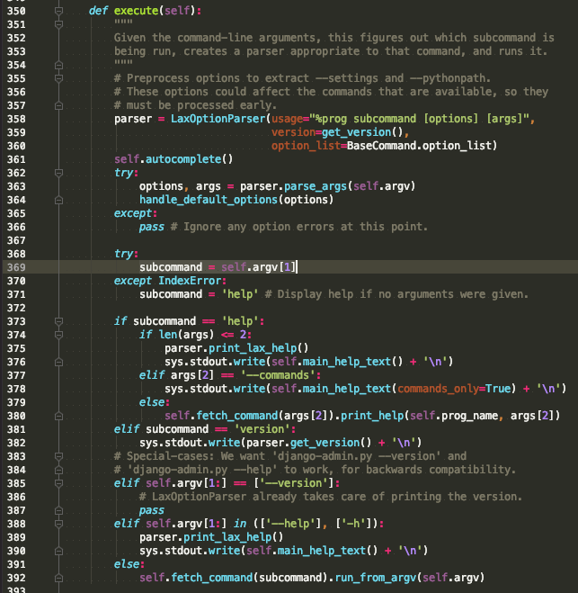

--- 
title: {{ title }} 
date: {{  }}
top: false
cover: false
password:
toc: true 
mathjax: true 
summary: 
tags: 
categories: 
---

看一下django的一些源码，基于python2.7.16，Django 1.6.11，为什么基于这么老的版本是因为公司项目是基于这个版本的

1. 启动

启动是基于manage.py文件

```python
#!/usr/bin/env python
import os
import sys

if __name__ == "__main__":
    os.environ.setdefault("DJANGO_SETTINGS_MODULE", "settings")

    from django.core.management import execute_from_command_line

    execute_from_command_line(sys.argv)
```

在引入execute_from_command_line的时候，会把management目录的__init__.py里跑一遍，其中django.core.management.base里引用了django

django目录的__init__文件只有一个get_version函数

```python
VERSION = (1, 6, 11, 'final', 0)

def get_version(*args, **kwargs):
    # Don't litter django/__init__.py with all the get_version stuff.
    # Only import if it's actually called.
    from django.utils.version import get_version
    return get_version(*args, **kwargs)
```

get_version函数可以看到django版本有四种，alpha/beta/rc/final，其中rc指的是Release Candidate（候选版本）。变量命名上，使用了mapping而不是dict。

```python
def get_version(version=None):
    "Returns a PEP 386-compliant version number from VERSION."
    if version is None:
        from django import VERSION as version
    else:
        assert len(version) == 5
        assert version[3] in ('alpha', 'beta', 'rc', 'final')

    # Now build the two parts of the version number:
    # main = X.Y[.Z]
    # sub = .devN - for pre-alpha releases
    #     | {a|b|c}N - for alpha, beta and rc releases

    parts = 2 if version[2] == 0 else 3
    main = '.'.join(str(x) for x in version[:parts])

    sub = ''
    if version[3] == 'alpha' and version[4] == 0:
        git_changeset = get_git_changeset()
        if git_changeset:
            sub = '.dev%s' % git_changeset

    elif version[3] != 'final':
        mapping = {'alpha': 'a', 'beta': 'b', 'rc': 'c'}
        sub = mapping[version[3]] + str(version[4])

    return str(main + sub)
```

做完这些引入后，执行execute_from_command_line

```python
def execute_from_command_line(argv=None):
    """
    A simple method that runs a ManagementUtility.
    """
    utility = ManagementUtility(argv)
    utility.execute()
```

在execute中363行首先对传参进行各种检验，即我们执行`python manage.py xxx -ff qw`时后面的部分

```python
options, args = parser.parse_args(self.argv)
```

 
 然后比较重要的是`fetch_command`函数，这个函数很有意思，它调用了`get_commands`函数

```python
def fetch_command(self, subcommand):
    """
    Tries to fetch the given subcommand, printing a message with the
    appropriate command called from the command line (usually
    "django-admin.py" or "manage.py") if it can't be found.
    """
    # Get commands outside of try block to prevent swallowing exceptions
    commands = get_commands()
    try:
        app_name = commands[subcommand]
    except KeyError:
        sys.stderr.write("Unknown command: %r\nType '%s help' for usage.\n" % \
            (subcommand, self.prog_name))
        sys.exit(1)
    if isinstance(app_name, BaseCommand):
        # If the command is already loaded, use it directly.
        klass = app_name
    else:
        klass = load_command_class(app_name, subcommand)
    return klass
```

`get_commands`其实就是一个注册的过程，注释写的比较清楚了，会去读core包里的命令及已注册app包里的命令

```python
"""
This works by looking for a management.commands package in django.core, and
in each installed application -- if a commands package exists, all commands
in that package are registered.
"""
```

这里有个全局变量`_commands`，当`_commands`为`None`时才会初始化

```python
def get_commands():
    global _commands
    if _commands is None:
        _commands = dict([(name, 'django.core') for name in find_commands(__path__[0])])

        # Find the installed apps
        from django.conf import settings
        try:
            apps = settings.INSTALLED_APPS
        except ImproperlyConfigured:
            # Still useful for commands that do not require functional settings,
            # like startproject or help
            apps = []

        # Find and load the management module for each installed app.
        for app_name in apps:
            try:
                path = find_management_module(app_name)
                _commands.update(dict([(name, app_name)
                                       for name in find_commands(path)]))
            except ImportError:
                pass # No management module - ignore this app

    return _commands
```

可以看到是先取的django.core这个默认包里的命令，再去找注册的app`apps = settings.INSTALLED_APPS`
`find_management_module`方法中写死了一个变量`'management'`，这意味着你如果要写一个命令，必须在你的app目录下加一个management的目录
调用`imp.find_module`方法查找是否存在`app_name/management`模块，所以这里需要注意的是并没有递归查找，如果你的目录结构是`app_name/sub_app_name/management`，那你必须注册`app_name/sub_app_name`
在找到management的目录后，再调用了`find_commands`方法，这里又有一个固定变量`commands`，所以你的命令必须在`app_name/management/commands`里

```python
def find_commands(management_dir):
    """
    Given a path to a management directory, returns a list of all the command
    names that are available.

    Returns an empty list if no commands are defined.
    """
    command_dir = os.path.join(management_dir, 'commands')
    try:
        return [f[:-3] for f in os.listdir(command_dir)
                if not f.startswith('_') and f.endswith('.py')]
    except OSError:
        return []
```

这里调用了`os.listdir`，基本等于`ls`
找到所有命令后用`load_command_class`来import

```python
def load_command_class(app_name, name):
    """
    Given a command name and an application name, returns the Command
    class instance. All errors raised by the import process
    (ImportError, AttributeError) are allowed to propagate.
    """
    module = import_module('%s.management.commands.%s' % (app_name, name))
    return module.Command()
```

这里又强调了下目录结构，然后就开始执行你的命令了
